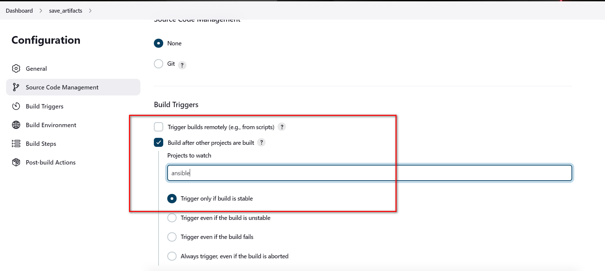
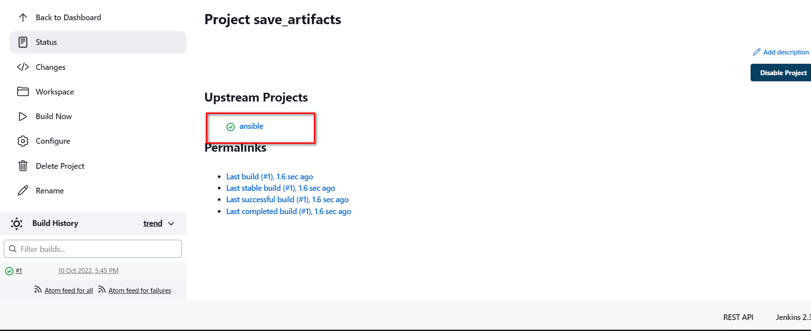
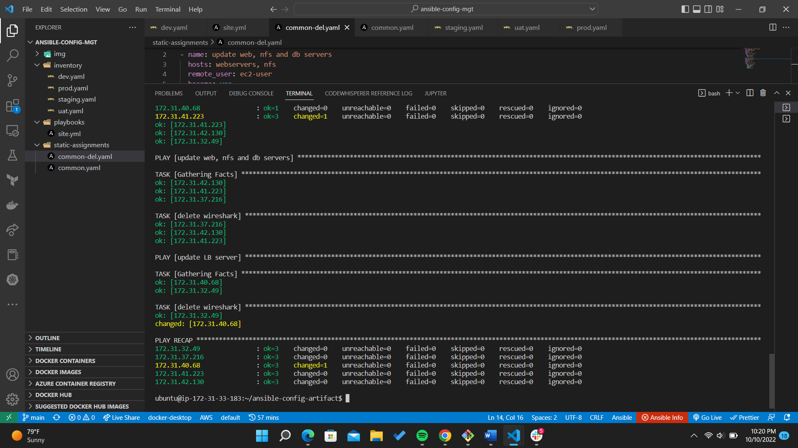
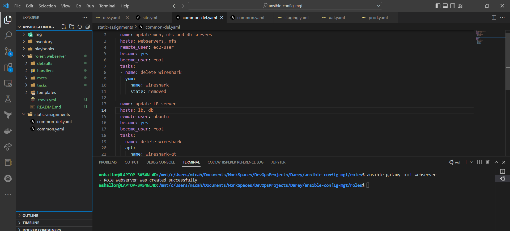
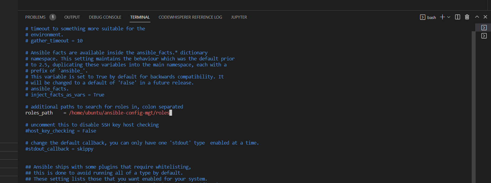
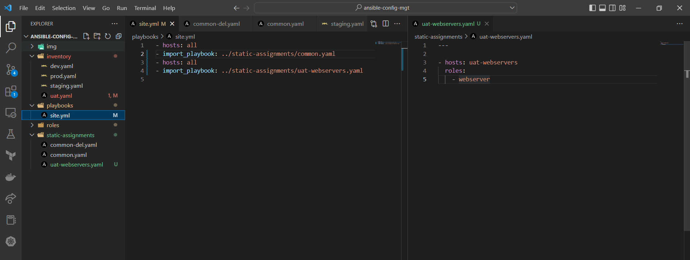
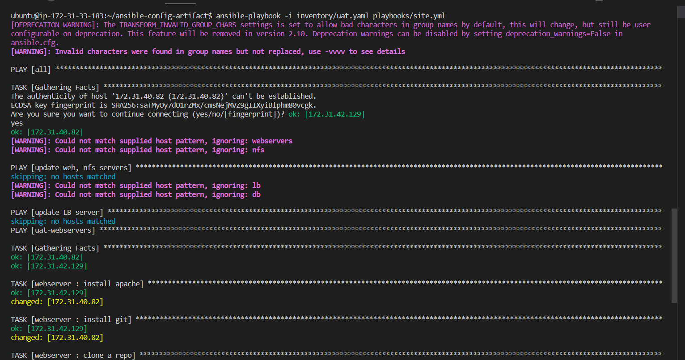
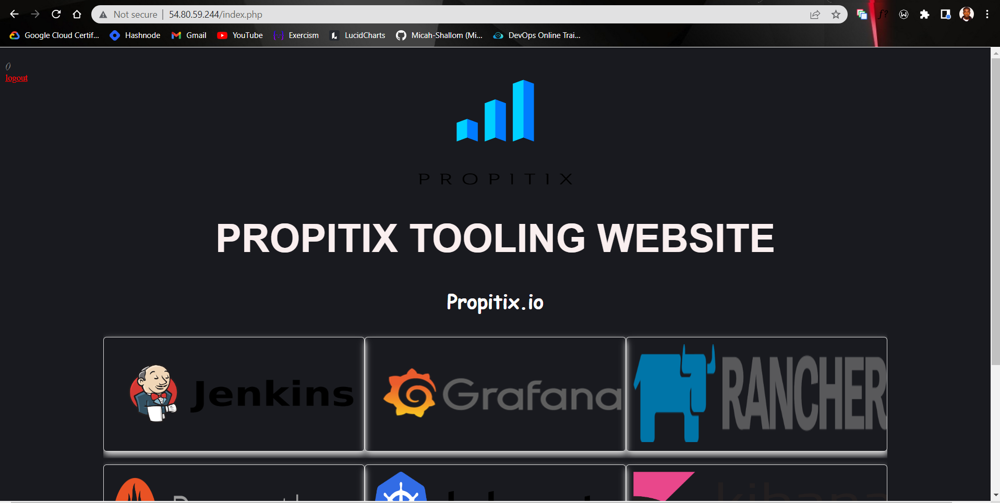

# Jenkins CI/CD on a 3-tier application && Ansible Configuration Management Dev and UAT servers using Static Assignments

## Ansible Refactoring and Static Assignments (IMPORTS AND ROLES)

In the previous project, I implemented CI/CD and Configuration Managment solution on the Development Servers using Ansible [Ansible_Automate_Project](https://github.com/apotitech/DevOps_Projects/tree/main/11.ANSIBLE%E2%80%93AUTOMATE_PROJECT_7_TO_10).


### **In this project, I will be extending the functionality of this architecture and introducing configurations for UAT environment.**


#

## STEP 1 - Jenkins Job Enhancement
#

Install a plugin on Jenkins-Ansible server called `COPY-ARTIFACTS`.


On the Jenkins-Ansible server, create a new directory called `ansible-config-artifact` <br/>
```
sudo mkdir /home/ubuntu/ansible-config-artifact
```
Change permission of the directory
```
chmod -R 0777 /home/ubuntu/ansible-config-artifact
```

Create a new Freestyle project and name it `save_artifacts`.


This project will be triggered by completion of your existing `ansible` project. Configure it accordingly:





We configured the number of build to 2. This is useful because whenever the jenkins pipeline runs, it creates a directory for the artifacts and it takes alot of space. By specifying the number of build, we can choose to keep only 2 of the latest builds and discard the rest.

Test your set up by making some change in README.MD file inside your ansible-config-mgt repository (right inside master/main branch).

If both Jenkins jobs have completed one after another – you shall see your files inside /home/ubuntu/ansible-config-artifact directory and it will be updated with every commit to your master branch.

Now your Jenkins pipeline is more neat and clean.

#

## Step 2 – Refactor Ansible code by importing other playbooks into site.yml
#

In [Project 11](https://github.com/apotitech/DevOps_Projects/tree/main/11.ANSIBLE%E2%80%93AUTOMATE_PROJECT_7_TO_10) , I wrote all tasks in a single playbook `common.yml`, now it is pretty simple set of instructions for only 2 types of OS, but imagine you have many more tasks and you need to apply this playbook to other servers with different requirements. In this case, you will have to read through the whole playbook to check if all tasks written there are applicable and is there anything that you need to add for certain server/OS families. Very fast it will become a tedious exercise and your playbook will become messy with many commented parts. Your DevOps colleagues will not appreciate such organization of your codes and it will be difficult for them to use your playbook.

- In playbooks folder, create a new file and name it `site.yml` – This file will now be considered as an entry point into the entire infrastructure configuration.

- Create a new folder in root of the repository and name it static-assignments. The static-assignments folder is where all other children playbooks will be stored
- Move common.yml file into the newly created static-assignments folder.

- Inside site.yml file, import common.yml playbook. 


- Run ansible-playbook command against the dev environment
- create another playbook under static-assignments and name it common-del.yml. In this playbook, configure deletion of wireshark utility.
```
---
- name: update web, nfs and db servers
  hosts: webservers, nfs, db
  remote_user: ec2-user
  become: yes
  become_user: root
  tasks:
  - name: delete wireshark
    yum:
      name: wireshark
      state: removed

- name: update LB server
  hosts: lb
  remote_user: ubuntu
  become: yes
  become_user: root
  tasks:
  - name: delete wireshark
    apt:
      name: wireshark-qt
      state: absent
      autoremove: yes
      purge: yes
      autoclean: yes
```
- We update site.yml with - import_playbook: ../static-assignments/common-del.yml instead of common.yml and run it against dev servers

```
cd /home/ubuntu/ansible-config-mgt/


ansible-playbook -i inventory/dev.yml playbooks/site.yaml
```

- Make sure that wireshark is deleted on all the servers by running wireshark --version
  



#

## CONFIGURE UAT WEBSERVERS WITH A ROLE ‘WEBSERVER’
## Step 3 – Configure UAT Webservers with a role ‘Webserver’

- Launch 2 fresh EC2 instances using RHEL 8 image, we will use them as our uat servers, so give them names accordingly – Web1-UAT and Web2-UAT.


- Create a role using an Ansible utility called ansible-galaxy inside ansible-config-mgt/roles directory (you need to create roles directory upfront)
```
mkdir roles
cd roles
ansible-galaxy init webserver
```
- removing unnecessary directories and files, the roles structure should look like this

```
└── webserver
    ├── README.md
    ├── defaults
    │   └── main.yml
    ├── handlers
    │   └── main.yml
    ├── meta
    │   └── main.yml
    ├── tasks
    │   └── main.yml
    └── templates
```
- Update your inventory ansible-config-mgt/inventory/uat.yml file with IP addresses of your 2 UAT Web servers
```
[uat-webservers]
<Web1-UAT-Server-Private-IP-Address> ansible_ssh_user='ec2-user' 

<Web2-UAT-Server-Private-IP-Address> ansible_ssh_user='ec2-user' 
```

- In /etc/ansible/ansible.cfg file uncomment roles_path string and provide a full path to your roles directory `roles_path    = /home/ubuntu/ansible-config-mgt/roles`, so Ansible could know where to find configured roles.
  



```
Install and configure Apache (httpd service)
Clone Tooling website from GitHub https://github.com/<your-name>/tooling.git.
Ensure the tooling website code is deployed to /var/www/html on each of 2 UAT Web servers.
Make sure httpd service is started
```

Add the following to the main.yml of the webserver role
```
---
- name: install apache
  become: true
  ansible.builtin.yum:
    name: "httpd"
    state: present

- name: install git
  become: true
  ansible.builtin.yum:
    name: "git"
    state: present

- name: clone a repo
  become: true
  ansible.builtin.git:
    repo: https://github.com/<your-name>/tooling.git
    dest: /var/www/html
    force: yes

- name: copy html content to one level up
  become: true
  command: cp -r /var/www/html/html/ /var/www/

- name: Start service httpd, if not started
  become: true
  ansible.builtin.service:
    name: httpd
    state: started

- name: recursively remove /var/www/html/html/ directory
  become: true
  ansible.builtin.file:
    path: /var/www/html/html
    state: absent
```
#

### REFERENCE WEBSERVER ROLE
### Step 4 – Reference ‘Webserver’ role
- In the static-assignments folder, we create a new assignment for uat-webservers `uat-webservers.yml`. 
  
Then we reference the role
```
---
- hosts: uat-webservers
  roles:
     - webserver
```

Since the entry point to our ansible configuration is the `site.yml` file. Therefore, you need to refer your `uat-webservers.yml` role inside `site.yml`.

So, we should have this in site.yml

```
---
- hosts: all
- import_playbook: ../static-assignments/common.yml

- hosts: uat-webservers
- import_playbook: ../static-assignments/uat-webservers.yml
```



- Commit your changes, create a Pull Request and merge them to main branch, make sure webhook triggered two consequent Jenkins jobs, they ran successfully and copied all the files to your Jenkins-Ansible server into `/home/ubuntu/ansible-config-mgt/` directory.

Now run the playbook against your uat inventory and see what happens:

```
sudo ansible-playbook -i /home/ubuntu/ansible-config-mgt/inventory/uat.yml /home/ubuntu/ansible-config-mgt/playbooks/site.yaml
```
Test the webserver configurations on the browser


#
# Code containing all configuration can be found in the [ansible-config-mgt repository](https://github.com/apotitech/ansible-config-mgt)
#